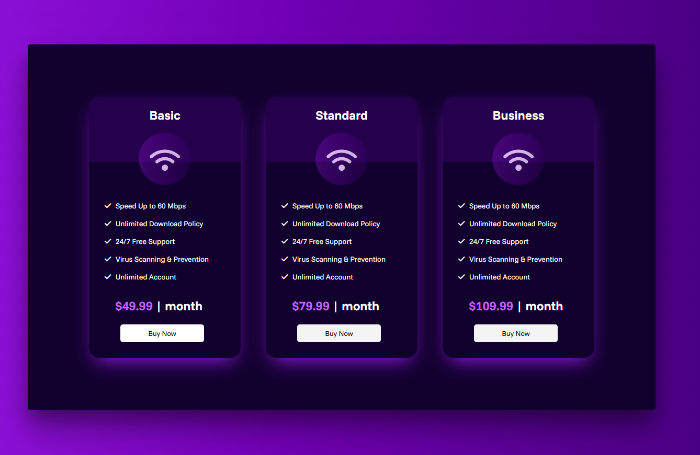

# Landing Page Designs & UI Components
>Collection of UI designs, layouts, and components built with HTML & CSS.

## Table of Contents

* [User Input & Forms](#user-input--forms--link)
* [User Profile & ID Cards](#user-profile--id-cards--link)
* [Subscription & Pricing Cards](#subscription--pricing-cards--link)
* [Landing Page Cards](#landing-page-cards--link)

## User Input & Forms | :link: [Repo](./User-Input-and-Forms)
<table>
    <tr>
        <td align="center">
        
         
         
        <a href="./User-Input-and-Forms/01-Password-UI">&nbsp;&nbsp;<b>01-Password UI</b></a>
        </td>
    </tr>
</table>

## User Profile & ID Cards | :link: [Repo](./Profile-ID-Cards)

<table>
    <tr>
        <td align="center">
        
         
         
        <a href="./Profile-ID-Cards/01-Profile-Card-UI">&nbsp;&nbsp;<b>01-Profile Card UI</b></a>
        </td>
    </tr>
</table>

## Subscription & Pricing Cards | :link: [Repo](./Subscription-Pricing-Cards)

<table>
    <tr>
        <td align="center">
            
             
             
            <a href="./Subscription-Pricing-Cards/01-Cards">&nbsp;&nbsp;<b>01-Cards</b></a>
        </td>
        <td align="center">
            
             
             
            <a href="./Subscription-Pricing-Cards/02-Cards">&nbsp;&nbsp;<b>02-Cards</b></a>
        </td>
        <td align="center">
            
             
             
            <a href="./Subscription-Pricing-Cards/03-Cards">&nbsp;&nbsp;<b>03-Cards</b></a>
        </td>
    </tr>
    <tr>
        <td align="center">
            
             
             
            <a href="./Subscription-Pricing-Cards/04-Cards">&nbsp;&nbsp;<b>04-Cards</b></a>
        </td>
        <td align="center">
            
             
             
            <a href="./Subscription-Pricing-Cards/05-Cards">&nbsp;&nbsp;<b>05-Cards</b></a>
        </td>
        <td align="center">
            
             
             
            <a href="./Subscription-Pricing-Cards/06-Cards">&nbsp;&nbsp;<b>06-Cards</b></a>
        </td>
    </tr>
</table>

## Landing Page Cards | :link: [Repo](./Landing-Page-Cards)

<table>
    <tr>
        <td align="center">
            
             
             
            <a href="./Landing-Page-Cards/01-Travel-Guide-UI">&nbsp;&nbsp;<b>01-Travel Guide UI</b></a>
        </td>
        <td align="center">
            
             
             
            <a href="./Landing-Page-Cards/02-MIRig">&nbsp;&nbsp;<b>02-MIRig UI</b></a>
        </td>
        <td align="center">
            
             
             
            <a href="./Landing-Page-Cards/03-Love-of-Coffee">&nbsp;&nbsp;<b>03-Love of Coffee UI</b></a>
        </td>
    </tr>
</table>