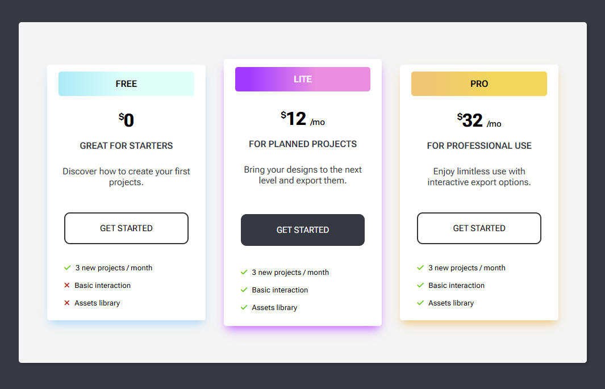
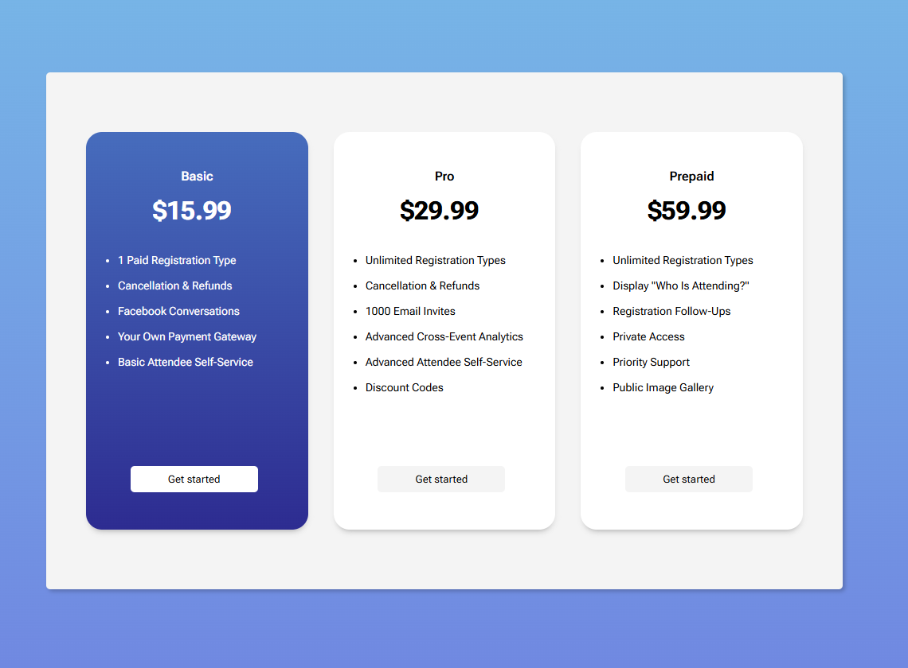

# Subscription & Pricing Cards

<table>
    <tr>
        <td align="center">
            
             
             
            <a href="./01-Cards">&nbsp;&nbsp;<b>01-Cards</b></a>
        </td>
        <td align="center">
            
             
             
            <a href="./02-Cards">&nbsp;&nbsp;<b>02-Cards</b></a>
        </td>
        <td align="center">
            
             
             
            <a href="./03-Cards">&nbsp;&nbsp;<b>03-Cards</b></a>
        </td>
    </tr>
    <tr>
        <td align="center">
            
             
             
            <a href="./04-Cards">&nbsp;&nbsp;<b>04-Cards</b></a>
        </td>
        <td align="center">
            
             
             
            <a href="./05-Cards">&nbsp;&nbsp;<b>05-Cards</b></a>
        </td>
        <td align="center">
            
             
             
            <a href="./06-Cards">&nbsp;&nbsp;<b>06-Cards</b></a>
        </td>
    </tr>
</table>